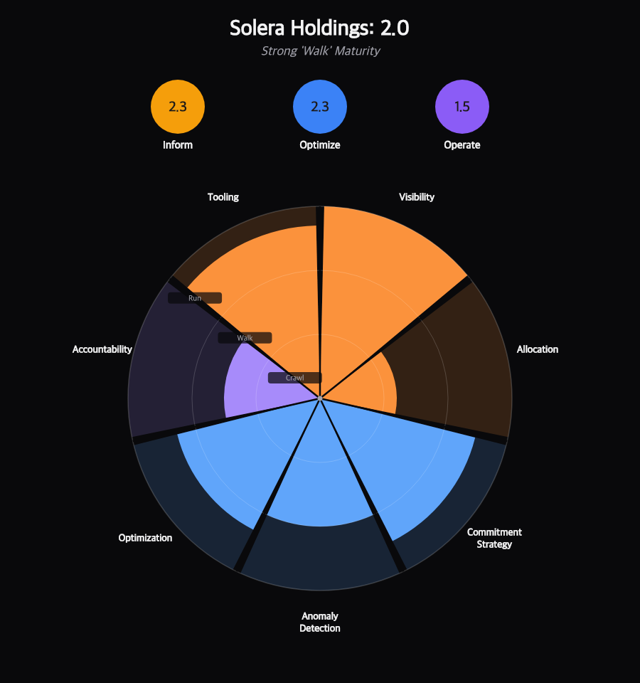
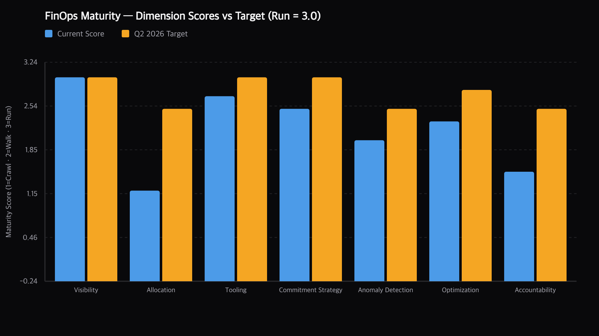

# Executive Summary

Solera Holdings is operating at a **strong Walk** level of FinOps maturity, with an overall score of **2.0 / 3.0**. The foundation is excellent — four clouds connected, 90 perspectives, six cost categories, and **$1.99M/year in validated savings already running** from Commitment Orchestration and AutoStopping. The path to Run maturity is clear and dependent on closing two specific gaps.

::: metrics
- label: Monthly savings run-rate
  value: $166,312
  trend: $1.99M annualised
  tone: success
- label: Azure spend since Feb
  value: +1,146%
  trend: From $329K to $4.1M/month
  tone: critical
- label: Open recommendations
  value: $92,833
  trend: $1.11M annualised opportunity
  tone: risk
- label: AWS allocation rate
  value: 4%
  trend: Benchmark 80% · Stage 4 blocked
  tone: critical
:::

::: critical Azure governance failure
Azure spend grew from **~$329K in February** to **$4.1M MTD in April** — a **13× increase** — without triggering any anomaly alert, budget breach, or review. There is currently no budget and no anomaly rule on the Azure default perspective. This is the single most urgent finding in this assessment.
:::

## Three priority actions

| # | Action | Impact |
|---|---|---|
| 1 | Investigate Azure spend spike + apply budgets & anomaly rules | ~$3.8M/month currently uncontrolled |
| 2 | Expand Cost Category rules to close AWS allocation gap | Unblocks Stage 4 accountability |
| 3 | Migrate unmanaged Savings Plans to CO | ~$491K/year recaptured under management |

---

# Overall Maturity Score

| Group | Score | Level | Dimensions |
|---|---|---|---|
| **Inform** | 2.3 | Walk | Visibility · Allocation · Tooling |
| **Optimize** | 2.3 | Walk | Commitment Strategy · Anomaly Detection · Optimization |
| **Operate** | 1.5 | Walk | Accountability |
| **Overall** | **2.0** | **Walk** | All seven dimensions |

::: info How to read this chart
Scores are based on the FinOps Foundation Crawl / Walk / Run framework. Crawl is 1.0–1.49 (capability exists but inconsistent), Walk is 1.5–2.49 (consistent across most scope, known gaps), Run is 2.5–3.0 (comprehensive, automated, estate-wide).
:::

## Dimension scores vs Q2 2026 target

| Dimension | Current | Q2 2026 Target | Gap | Priority |
|---|---|---|---|---|
| Visibility | 3.0 · Run | 3.0 | — | — |
| Tooling | 2.7 · Run | 3.0 | 0.3 | Low |
| Commitment Strategy | 2.5 · Walk→Run | 3.0 | 0.5 | Medium |
| Optimization | 2.3 · Walk | 2.8 | 0.5 | Medium |
| Anomaly Detection | 2.0 · Walk | 2.5 | 0.5 | Medium |
| Accountability | 1.5 · Walk | 2.5 | **1.0** | **High** |
| Allocation | 1.2 · Crawl | 2.5 | **1.3** | **Critical** |

---

# Dimension Deep Dive

## Visibility — 3.0 (Run)

::: success Benchmark met
Solera has achieved best-practice visibility. Multi-cloud data is centralized, perspectives are structured by business unit, and Harness CCM is the single source of truth for cloud cost data. No action required.
:::

**Evidence from data:**

- 90 perspectives configured across 8+ folders
- 6 cost category mappings deployed (AutoMate Client, Business Units, eDriving, AutoMate RegEx, AWS Enterprise Support, AWS Discounts)
- All four cloud providers fully connected with active data ingestion
- Real-time cost data available for AWS, Azure, GCP, and Kubernetes

## Allocation — 1.2 (Crawl)

::: critical Stage 4 blocker
AWS allocation rate is at **~4%** against an 80% benchmark. The vast majority of AWS spend is landing in the `Unattributed` bucket. Without allocation, chargeback and showback to business units is not possible, and no meaningful per-BU budgets can be created.
:::

**Root cause hypothesis.** The "AutoMate Client" cost category rules are scoped too narrowly — likely matching only a subset of AWS accounts or service tags.

**Actions to reach Walk (2.5):**

1. Audit the "AutoMate Client" cost category rules — identify which accounts/services fall through to Unattributed
2. Expand rules to cover all AWS accounts, using Business Units as the primary allocation layer
3. Define a tagging standard for untagged resources and enforce via Asset Governance
4. Target: ≥ 80% allocation within 60 days

## Tooling — 2.7 (Run)

All Harness CCM modules are licensed and active: FinOps Agent (MCP integration) in use, Cluster Orchestrator connected, Commitment Orchestrator enabled on 4 AWS payer accounts, AutoStopping deployed across 125 rules, Asset Governance active across AWS and Azure.

::: action To reach 3.0
- Enable K8s AutoStopping for non-production namespaces
- Schedule a weekly automated FinOps Agent briefing via Dynamic Perspective Reports
:::

## Commitment Strategy — 2.5 (Walk → Run)

::: metrics
- label: RI utilization
  value: 95.1%
  trend: Benchmark ≥ 80%
  tone: success
- label: SP utilization
  value: 99.6%
  trend: Benchmark ≥ 95%
  tone: success
- label: On-Demand share
  value: 7.79%
  trend: Benchmark < 10%
  tone: success
- label: Unmanaged SPs (90d)
  value: $122,908
  trend: ~$491K/year outside CO
  tone: risk
:::

**Actions to reach Run (3.0):**

1. Identify which Savings Plans are generating the $122,908 unmanaged savings
2. Import them into Commitment Orchestrator — zero new purchases required, zero risk
3. Evaluate RDS and ElastiCache for RI coverage (currently no CO coverage on these services)

## Anomaly Detection — 2.0 (Walk)

::: warning Azure blind spot
The Azure spend jump from $329K to $4.1M/month generated **zero anomaly alerts**. Anomaly detection is not configured on the Azure default perspective. This is directly responsible for the governance failure in the executive summary.
:::

**Actions to reach 2.5:**

1. Configure anomaly detection on the Azure default perspective immediately
2. Set alert thresholds at BU level for all cost category buckets
3. Route anomaly alerts to the FinOps team Slack/email channel

## Optimization — 2.3 (Walk)

| Module | Status | Monthly Value |
|---|---|---|
| Commitment Orchestration | Active | $154,788 |
| AutoStopping (125 rules) | Active | $11,524 / 30d |
| Open Recommendations (top 10) | Unactioned | $92,833 opportunity |
| AutoStopping K8s | Not configured | $0 |
| 4 errored AS rules | Risk | — |

::: risk Production RDS rule in error state
One of the four errored AutoStopping rules (Valhalla DealerFire Prod RDS) appears to target a production RDS instance. This needs immediate review — it may have been incorrectly scoped or be masking a real connectivity issue.
:::

## Accountability — 1.5 (Walk)

::: critical Thin budget coverage
Solera has **3 budgets covering ~$500K/month** of spend. The estate runs at **$8.4M/month**. The AWS default ($4.17M MTD) and Azure default ($4.10M MTD) have **no budget at all**. Over 90% of spend operates without financial accountability controls.
:::

A budget alert on the Azure default perspective would have flagged the spike in March — weeks before it compounded into April.

**Actions to reach 2.5:**

1. Create a budget on the Azure default perspective immediately — use March actuals ($2.72M) as baseline with a 10% alert threshold
2. Create BU-level budgets tied to Cost Categories (requires closing the Allocation gap first)
3. Investigate and reconcile the budget vs perspective discrepancy for eDriving and AutoMate Client

---

# Roadmap to Run

## Q2 2026 — close the critical gaps

| Sprint | Action | Owner | Maturity Impact |
|---|---|---|---|
| Week 1 | Configure Azure anomaly detection | FinOps Engineer | Anomaly Detection: 2.0 → 2.5 |
| Week 1 | Fix 4 errored AutoStopping rules | Platform Eng | Optimization: removes risk |
| Week 1 | Create Azure default perspective budget | FinOps Lead | Accountability: 1.5 → 1.8 |
| Week 2 | Action EBS snapshot cleanup ($19,247/mo) | Cloud Ops | Optimization: 2.3 → 2.4 |
| Week 2 | Investigate Azure spike root cause | FinOps + Eng | Risk mitigation |
| Week 3–4 | Migrate unmanaged SPs to CO | FinOps Engineer | Commitment Strategy: 2.5 → 2.8 |
| Month 2 | Audit + expand Cost Category rules | FinOps Lead | Allocation: 1.2 → 2.0 |
| Month 2 | Enable Spot for QA/Dev EKS node groups | Platform Eng | Optimization: 2.3 → 2.6 |
| Month 3 | Create BU-level budgets (all major BUs) | FinOps Lead | Accountability: 1.8 → 2.5 |
| Month 3 | Drive AWS allocation to ≥ 80% | FinOps Lead | Allocation: 2.0 → 2.5 |

## Q3 2026 — reach Run

| Action | Maturity Impact |
|---|---|
| Enable K8s AutoStopping for idle namespaces | Optimization → 2.8 |
| Evaluate RDS + ElastiCache CO coverage | Commitment Strategy → 3.0 |
| Enforce governance rules in auto-remediation mode | Accountability → 2.8 |
| FY forecast baseline aligned to savings run-rate | Overall → 2.7+ |
| Chargeback reporting live for all BUs | Allocation → 3.0 |

---

# Savings Opportunity

## Platform savings already running

| Source | Monthly | Annualised |
|---|---|---|
| Commitment Orchestration (managed) | $154,788 | $1,857,456 |
| AutoStopping | $11,524 | $138,288 |
| **Total** | **$166,312** | **$1,995,744** |

## Capturable opportunity

| Opportunity | Monthly | Annual | Effort |
|---|---|---|---|
| Migrate unmanaged Savings Plans to CO | $40,969 | $491,628 | Low |
| EBS snapshot cleanup (#3 + #5) | $19,247 | $230,964 | Low |
| Spireon idle RDS (#7 + #10) | $11,267 | $135,204 | Low |
| smartdrive-prd node pool right-size (#1) | $17,898 | $214,776 | High |
| Azure underutilized VMs (#2) | $14,257 | $171,084 | Medium |
| Spireon idle ElastiCache (#6) | $8,716 | $104,592 | Medium |
| QA/Dev EKS Spot migration | ~$15,000 | ~$180,000 | Medium |
| **Total** | **~$127,354** | **~$1,528,248** | |

::: success Combined platform value potential
Savings already running ($1.99M) + capturable opportunity ($1.53M) = **~$3.5M/year total platform value**.
:::

---

# Key Risks

| Risk | Severity | Status |
|---|---|---|
| Azure spend at $4.1M MTD with no budget or anomaly alerts | Critical | Immediate action required |
| AWS allocation rate at 4% — Stage 4 blocked | Critical | 60-day remediation plan needed |
| Valhalla DealerFire Prod RDS in AutoStopping error state | High | May be incorrectly scoped rule |
| smartdrive-prd node pool recommendation (72→3 nodes) | High | Review burst requirements first |
| Budget vs perspective discrepancy ($8–9K gap) | Medium | Flag to FinOps lead |
| No K8s AutoStopping configured | Medium | Opportunity, not active risk |

---

# Appendix — Scoring Methodology

Scores are derived from the FinOps Foundation Crawl / Walk / Run framework, mapped to a 1–3 numeric scale:

Crawl
: **1.0 – 1.49** — Basic capability exists but inconsistently applied or covering <30% of scope.

Walk
: **1.5 – 2.49** — Capability is consistent and covers the majority of scope; gaps are known and being addressed.

Run
: **2.5 – 3.0** — Capability is comprehensive, automated, and optimized across the full estate.

Scores for each dimension are derived from quantitative evidence from the Harness CCM API (`cost_metadata`, `cost_breakdown`, `cost_commitment_summary`, `cost_autostopping_savings_cumulative`, `cost_recommendation`, `cost_budget`) cross-referenced against FinOps Foundation benchmark thresholds.

| Dimension | Primary evidence | Score driver |
|---|---|---|
| Visibility | 90 perspectives, 6 cost categories, 4 clouds | Full coverage → 3.0 |
| Allocation | AWS allocation rate ~4% vs 80% benchmark | Critical gap → 1.2 |
| Tooling | All CCM modules active, Agent + MCP in use | Near-complete → 2.7 |
| Commitment Strategy | RI 95.1%, SP 99.6%, $122K unmanaged | Strong but gap → 2.5 |
| Anomaly Detection | 0 anomalies (AWS/GCP), Azure uncovered | Partial coverage → 2.0 |
| Optimization | CO + AS active, $92K open recs, 4 errored rules | Active but gaps → 2.3 |
| Accountability | 3 budgets on $8.4M/month estate | Thin coverage → 1.5 |
